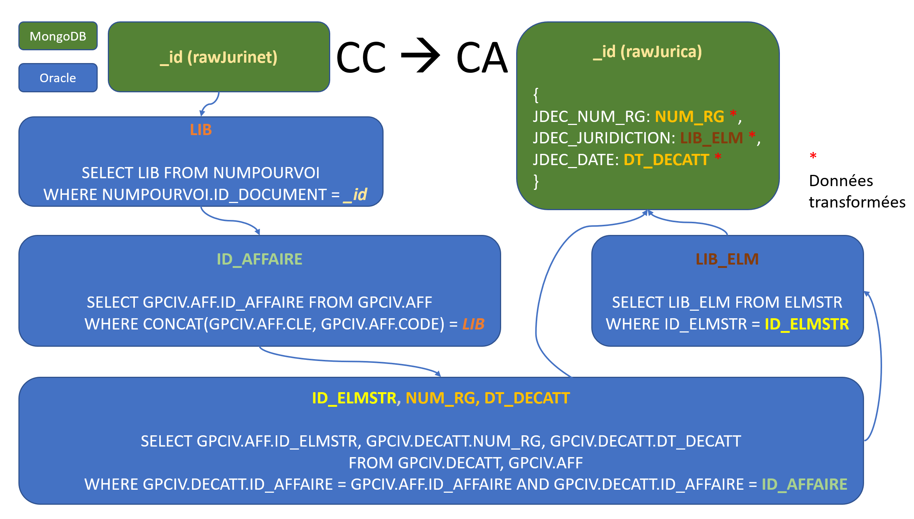

# Chaînage vertical des décisions

## Nouveau système `judilibre-index/affaires`

### Utilisation

### Problématiques

Le système d'information actuel n'est pas assez structuré pour résoudre le chaînage des décisions de manière fiable et efficace (tables disjointes, références hétérogènes et sous-optimales, en termes d'indexation comme de requêtage). Il en résulte des traitements longs, lourds et imprécis.



### Objectifs

Regrouper chronologiquement toutes les décisions (CC, CA, autres) qui sont en relation entre elles (d'après Nomos et d'après l'API de zonage), à la fois pour résoudre rapidement leur chaînage — quel que soit le point de départ et quel que soit le sens du chaînage (Index), pour simplifier la publication de frises chronologiques (Judilibre) et enfin pour envisager l'homogénéisation de la pseudonymisation des décisions associées (Label).

**_En conséquence, la propriété `decatt` des documents de la collection `decisions` est obsolète et ne sera bientôt plus alimentée ni utilisée. La propriété `ids` des documents de la base `judilibre-index/affaires` la remplace._**

### Implémentation

- Base : `judilibre-index` ;
- Collection : `affaires` ;
- Modèle de données :
  - `_id` (_indexé_) : identifiant interne de l'ensemble de décisions (`ObjectId(...)`) ;
  - `numbers` (_indexé_) : liste des "numéros" des décisions (RG, pourvoi, etc.) tels que Nomos les référencie majoritairement — par exemple : `U8121289` (CC), `09/01206` (CA) ;
  - `ids` (_indexé_) : liste des identifiants internes (Jurinet, Jurica) des décisions connues, suivant le même format `sourceName:sourceId` que celui utilisé par la collection `judilibre-index/mainIndex` — par exemple : `jurinet:1784323` (CC), `jurica:2435122` (CA) ;
  - `affaires` (_indexé_) : liste de `ID_AFFAIRE` connus (identifiant utilisé notamment par les tables Oracle `GPCIV.AFF` et `GPCIV.DECATT`) - par exemple : `11122154` ;
  - `dates` (_indexé_) : liste des dates des décisions au format ISO-8601 — par exemple : `2018-07-12` (note: le contenu de cette liste est trié par ordre chronologique) ;
  - `jurisdictions`(_indexé_): liste des noms des juridictions associées aux décisions — par exemple : `Conseil de prud'hommes de Caen`, `Cour de cassation` (note : on utilise autant que possible les intitulés référencés dans la table Oracle `ELMSTR`, qui peuvent diverger de ceux présents dans Jurica, c'est pour ça qu'il existe les méthodes `JuricaUtils.GetJuricaLocationFromELMSTRLocation()` et `JuricaUtils.GetELMSTRLocationFromJuricaLocation()` - par exemple : côté Jurica on trouve _"cour d'appel de Fort de France"_ tandis que côté ELMSTR on trouve _"Cour d'appel de Fort-de-France"_, ce dernier étant le seul intitulé correct) ;
  - `numbers_ids` : mapping clé/valeur entre `numbers` et `ids` — par exemple : `{ "U8121289": "jurinet:1784323" }` (note : s'il n'existe aucun `id` pour un `number` listé, c'est que la décision correspondante n'a pas été trouvée dans Nomos) ;
  - `numbers_affaires` : mapping clé/valeur entre `numbers` et `affaires` - par exemple `{ "U8121289": 11122154 }` (note : s'il n'existe aucune `affaire` pour un `number` listé, c'est qu'il s'agit d'un chaînage non référencé dans Nomos et probablement résolu via le zonage) ;
  - `numbers_dates` : mapping clé/valeur entre `numbers` et `dates` - par exemple : `{ "U8121289": "2018-07-12" }` (note : on ne référencie dans la collection `affaires` que les décisions dont on connait la date) ;
  - `numbers_jurisdictions` : mapping clé/valeur entre `numbers` et `jurisdictions` - par exemple : `{ "09/01206": "Cour d'appel de Caen" }` ;
  - `dates_jurisdictions` : mapping clé/valeur entre `dates` et `jurisdictions` - par exemple `{ "2018-07-12" : "Conseil de prud'hommes de Caen" }` (note : requis car certaines décisions détectées via le zonage n'ont pas de `number` et ne correspondent donc à rien dans nos bases de données).

### API REST

- **Point d'entrée** : `GET https://ind.opj.cour-de-cassation.justice.fr/affaires?<param>=<value>[&timeline=1]`
- `param` :
  - `id` : recherche par identifiant SDER/Judilibre, Jurinet ou Jurica (format `sourceName:sourceId` pour Jurinet et Jurica, par exemple : `?id=jurinet:1784323`, ou simplement `?id=5fca2aeba73772b5776cb72b` pour SDER/Judilibre) ;
  - `number` : recherche par "numéro" plus ou moins normalisé (RG, pourvoi, etc., par exemple : `?number=U8121289`, `?number=81-21.289`, `?number=86/00182`, `?number=86/182`, etc.) ;
  - `affaire` : recherche par identifiant d'affaire Nomos (par exemple : `?affaire=11122154`) ;
  - `date` : recherche par date au format ISO-8601 ou par date partielle (par exemple : `?date=2018-07-12` pour une date précise, `?date=2018-07` pour une recherche sur un mois donné, `?date=2018` pour une recherche sur une année entière) ;
  - `jurisdiction` : recherche par nom complet ou partiel de juridiction/siège (par exemple : `?jurisdiction=%22Cour%20de%20cassation%22` — autrement dit une recherche sur `"Cour de cassation"` — pour une recherche exacte, `?jurisdiction=orleans` pour une recherche comprenant la cour d'appel et autres tribunaux d'Orléans, etc.) ;
- Lorsqu'il y a plusieurs paramètres de recherche, ceux-ci sont combinés avec l'opérateur logique **ET** ;
- Si `timeline` est défini, alors la requête retourne pour chaque résultat un objet `timeline` contenant une frise chronologique pré-remplie.

### Exemples

**Exemple d'utilisation de l'API REST**

- `GET https://ind.opj.cour-de-cassation.justice.fr/affaires?number=P8910948` (ou `?number=8910948`, `?number=89-10.948`...):

```
[
  {
    _id: '6249476cb255b22dc3d6fb25',
    numbers: ['P8910948', '86/14882'],
    ids: ['jurinet:15732'],
    affaires: [163199],
    dates: ['1988-10-28', '1992-01-07'],
    jurisdictions: ['Cour de cassation', "Cour d'appel de Paris"],
    numbers_ids: { P8910948: 'jurinet:15732' },
    numbers_dates: { P8910948: '1992-01-07', '86/14882': '1988-10-28' },
    numbers_affaires: { P8910948: 163199, '86/14882': 163199 },
    numbers_jurisdictions: { P8910948: 'Cour de cassation', '86/14882': "Cour d'appel de Paris" },
    dates_jurisdictions: { '1992-01-07': 'Cour de cassation', '1988-10-28': "Cour d'appel de Paris" },
  },
]
```

- `GET https://ind.opj.cour-de-cassation.justice.fr/affaires?number=P8910948&timeline=1` (ajout de la timeline) :

```
[
  {
    _id: '6249476cb255b22dc3d6fb25',
    numbers: ['P8910948', '86/14882'],
    ids: ['jurinet:15732'],
    affaires: [163199],
    dates: ['1988-10-28', '1992-01-07'],
    jurisdictions: ['Cour de cassation', "Cour d'appel de Paris"],
    numbers_ids: { P8910948: 'jurinet:15732' },
    numbers_dates: { P8910948: '1992-01-07', '86/14882': '1988-10-28' },
    numbers_affaires: { P8910948: 163199, '86/14882': 163199 },
    numbers_jurisdictions: { P8910948: 'Cour de cassation', '86/14882': "Cour d'appel de Paris" },
    dates_jurisdictions: { '1992-01-07': 'Cour de cassation', '1988-10-28': "Cour d'appel de Paris" },
    timeline: [
      {
        date: '1988-10-28',
        jurisdiction: "Cour d'appel de Paris",
        decisions: [{ number: '86/14882', affaire: 163199 }],
      },
      {
        date: '1992-01-07',
        jurisdiction: 'Cour de cassation',
        decisions: [{ id: 'jurinet:15732', number: 'P8910948', affaire: 163199 }],
      },
    ],
  },
]
```

**Exemple de document de la collection `affaires`** (ici l'on n'a pas trouvé dans Jurica la décision de cour d'appel attaquée, ce qui n'empêche pas de produire une frise chronologique informative) :

```
{
  _id: ObjectId('62457a363e8e043742bc3069'),
  numbers: ['U9020962', '87/911'],
  ids: ['jurinet:16066'],
  affaires: [162965],
  dates: ['1990-09-11', '1992-02-18'],
  jurisdictions: ['Cour de cassation', "Cour d'appel de Toulouse"],
  numbers_ids: { U9020962: 'jurinet:16066' },
  numbers_dates: { U9020962: '1992-02-18', '87/911': '1990-09-11' },
  numbers_affaires: { U9020962: 162965, '87/911': 162965 },
  numbers_jurisdictions: {
    U9020962: 'Cour de cassation',
    '87/911': "Cour d'appel de Toulouse",
  },
  dates_jurisdictions: {
    '1992-02-18': 'Cour de cassation',
    '1990-09-11': "Cour d'appel de Toulouse",
  },
}
```

**Exemple d'usage pour Label (homogénéisation de la pseudonymisation)** : soit une décision Jurinet d'identifiant `1784323` (correspond à `_id` dans `rawJurinet` et à `sourceId` dans `decisions`), il suffit de faire une requête `db.getCollection('affaires').findOne({ _id: 'jurinet:1784323'})` pour récupérer le groupe de décisions qui lui sont associées et dont il faudrait homogénéiser la pseudonymisation, leurs identifiants étant listés dans la propriété `ids` du résultat.

**Exemple d'usage pour l'Index (chaînage)** : soit une décision Jurinet d'identifiant `1784323`, il suffit de faire une requête `db.getCollection('affaires').findOne({ _id: 'jurinet:1784323'})` pour récupérer le groupe de décisions qui lui sont associées. En itérant sur la propriété `dates` du résultat (laquelle est censée être triée par ordre chronologique), on peut facilement extraire le chaînage arrière (décisions ayant une date antérieure à celle de la décision ciblée) et le chaînage avant (décisions ayant une date postérieure à celle de la décision ciblée). L'utilisation du format ISO-8601 permet de directement trier les dates via `sort()` (chronologique) ou `sort().reverse()` (antéchronologiques).

**Exemple d'usage pour Judilibre (frise chronologique)** : soit une décision Jurinet d'identifiant `1784323`, il suffit de faire une requête `db.getCollection('affaires').findOne({ _id: 'jurinet:1784323'})` pour récupérer le groupe de décisions qui lui sont associées et dont il faut afficher la frise chronologique, celle-ci étant construite directement à partir de la propriété `dates` du résultat. Pour chaque date on récupère la ou les décisions correspondantes (via `numbers_dates`, puis `numbers_ids` pour vérifier leur disponibilité en base) et en absence de décision référencée en base on peut toujours afficher la juridiction (via `dates_jurisdictions`).

### Limitation actuelle

L'alimentation de cette collection est un processus extrêmement long ! Aujourd'hui cette alimentation est accomplie en parallèle par deux processus :

1. Par le job `buildAffaires` du projet `openjustice-sder`, qui parcourt l'intégralité du stock Jurinet et Jurica en partant des décisions les plus récentes (job exécuté en boucle tous les jours entre 3h et 23h) ;
2. Via le job `import` du projet `openjustice-sder`, qui recherche et référencie le chaînage pour toutes les nouvelles décisions issues du flux (chaque jour entre 8h et 12h).

## Chaînage arrière CC -> CA (ancien chaînage, obsolète)

**Objectif** : en partant d'une décision de la Cour de cassation, récupérer la décisions de la Cour d'appel qu'elle attaque (nécessairement antérieure).

**Limitations** : le transfert des décisions de cours d'appel vers la Cour de cassation côté WinCiCA n'est pas systématique ni automatisé (en tout cas il est moins systématique que la saisie de la référence de décisions attaquées via NOMOS), de sorte que nous ne disposons pas dans JuriCA de toutes les décisions de CA qui peuvent être référencées par la table `GPCIV.DECATT` via NOMOS !

**Algorithme**, d'après un mail de Richard ANGER daté du 03/03/2021 :

1. Point de départ : identifiant de la décision CC dans Jurinet (`DOCUMENT.ID_DOCUMENT`, par exemple : `1727146`)

2. On récupère le n° de pourvoi de la décision Jurinet : `SELECT NUMPOURVOICODE FROM NUMPOURVOI WHERE NUMPOURVOI.ID_DOCUMENT = {ID_DOCUMENT}`

   → `NUMPOURVOICODE` = n° de pourvoi sans clé (par exemple : `1826378`)

3. On récupère les informations correspondant à l'affaire : `SELECT ID_ELMSTR, ID_AFFAIRE FROM GPCIV.AFF WHERE GPCIV.AFF.CODE = {NUMPOURVOICODE}`

   → `ID_AFFAIRE` = identifiant du pourvoi
   (par exemple : `11110412`)

   → `ID_ELMSTR` = code permettant _a priori_ d'identifier la cour d'appel associée (par exemple : `100019`), une telle information étant paradoxalement absente de celles que l'on récupère ci-après depuis `GPCIV.DECATT`

4. On récupère les informations de la décisions attaquée, telles quelles ont été saisies dans NOMOS (_ne contient rien qui nous permette d'identifier la cour d'appel_) : `SELECT NUM_RG, DT_DECATT FROM GPCIV.DECATT WHERE GPCIV.DECATT.ID_AFFAIRE = {ID_AFFAIRE}`

   → `NUM_RG` = n° RG _supposé_ de la décision attaquée (par exemple : `16/02749`)

   → `DT_DECATT` = date _supposée_ la décision attaquée

5. [**OBSOLETE**] Afin de renforcer si nécessaire la résolution du chaînage, on récupère aussi un pseudo-identifiant de la cour d'appel _sans garantie de pertinence_ : `SELECT COUR_APPEL_RAT FROM ELMSTR WHERE ID_ELMSTR = {ID_ELMSTR}`

   → `COUR_APPEL_RAT` = pseudo-identifiant de la cour d'appel (par exemple : `CA59178`)

   A ce stade, et à partir d'un identifiant Jurinet, on obtient donc les informations suivantes, **qui sont les seules sur lesquelles on peut s'appuyer pour remonter vers une décision de JuriCA** :

   - `NUM_RG` = n° RG _supposé_ de la décision
   - `DT_DECATT` = date _supposée_ de la décision, ramenée au format `aaaa-mm-jj`
   - `COUR_APPEL_RAT` = pseudo-identifiant _approximatif_ de la cour d'appel ayant rendu la décision

6. [**OBSOLETE**] On tente de récupérer la décision JuriCA qui correspond, _en sachant que le n° RG n'est pas un identifiant unique et que la date peut être fausse (on limite son décalage à J+/-2)_ : `SELECT JDEC_ID, JDEC_DATE, JDEC_ID_JURIDICTION FROM JCA_DECISION WHERE TRIM(JCA_DECISION.JDEC_NUM_RG) = {NUM_RG} AND (JCA_DECISION.JDEC_DATE = {DT_DECATT} OR JCA_DECISION.JDEC_DATE = {DT_DECATT J - 1} OR JCA_DECISION.JDEC_DATE = {DT_DECATT J + 1} OR JCA_DECISION.JDEC_DATE = {DT_DECATT J - 2} OR JCA_DECISION.JDEC_DATE = {DT_DECATT J + 2})`

   Note : les opérateurs `<` et `>` semblent mal fonctionner sur les dates dans Oracle, en tout cas avec les données dont on dispose, d'où la requête "verbeuse"...

   Pour rappel : on ne dispose d'aucun moyen de pointer directement la cour d'appel dans la requête, donc on peut récupérer plusieurs décisions qui sont relatives à d'autres cours d'appel que celle qui nous concerne (en l'espace de quelques jours, plusieurs cours d'appel peuvent effectivement rendre des décisions différentes disposant du même n° RG !)

7. [**OBSOLETE**] On range chacune des décisions de JuriCA récupérées via la requête précédente par ordre de pertinence :

   1. Les décisions dont la date correspond exactement
   2. Les décisions dont la date correspond à J+/-1 _et_ dont la propriété `JDEC_ID_JURIDICTION` peut être mise en correspondance avec la donnée `COUR_APPEL_RAT`
   3. Les décisions dont la date correspond à J+/-2 _et_ dont la propriété `JDEC_ID_JURIDICTION` peut être mise en correspondance avec la donnée `COUR_APPEL_RAT`

   Note : la mise en correspondance de la propriété `JDEC_ID_JURIDICTION` avec la donnée `COUR_APPEL_RAT` échouant souvent (les gens saisissent n'importe quoi dans ces champs), ce critère n'est appliqué que pour restreindre fortement la prise en compte des décisions dont la date est en décalage avec celle saisie dans NOMOS. On part en effet du principe que la date saisie dans NOMOS est correcte, et donc qu'une décision de JuriCA ayant à la fois la bonne date et le bon n° RG doit être forcément la bonne (même s'il n'y a pas de correspondance directe entre `JDEC_ID_JURIDICTION` et `COUR_APPEL_RAT`, comme ces données sont trop hétérogènes pour constituer une certitude). Ce "flou" est bien entendu causé par l'absence de référentiel univoque de la cour d'appel dans la table `GPCIV.DECATT`.

   Si on a des décisions d'ordre de pertinence 1, alors on retourne leur `JDEC_ID`. Sinon, si on a des décisions d'ordre de pertinence 2, alors on retourne leur `JDEC_ID`. Sinon, si on a des décisions d'ordre de pertinence 3, alors on retourne leur `JDEC_ID`. Sinon on retourne une liste vide.

8. [**NOUVELLE METHODE**, remplace les points 5. , 6. et 7.] On tente de récupérer la décision JuriCA qui correspond, _en sachant que le n° RG est la principale information et que sa saisie est souvent incorrecte (de manière plus significative que la date mentionnée plus haut)_. L'essentiel des erreurs de saisie concerne les `0` qui peuvent précéder le second terme du n° RG (par exemple : `19/00187`). "On" a formé certains utilisateurs en leur disant que ces `0` sont facultatifs (alors qu'ils ne le sont pas du tout !), ainsi l'exemple précédent peut donner lieu à la saisie `19/187`. Intégrer un contournement de ces erreurs de saisie de n° RG s'avère plus bénéfique que d'intégrer un éventuel décalage de la date saisie (sachant qu'on ne peut pas se permettre de faire les deux en même temps). On utilise donc une regexp pour rechercher la décision, en considérant que la date saisie est la bonne (tant pis pour les erreurs à ce niveau) : `SELECT JCA_DECISION.JDEC_ID FROM JCA_DECISION WHERE REGEXP_LIKE(JCA_DECISION.JDEC_NUM_RG, '^0*{RGLeftTerm}/0*{RGRightTerm} *$') AND JCA_DECISION.JDEC_DATE = {DT_DECATT})`, où `RGLeftTerm` correspond au terme du n° RG à gauche du `/` débarrassé des `0` qui peuvent le préfixer (dans notre exemple `19`) et où `RGRightTerm` correspond au terme du n° RG à droite du `/` débarrassé des `0` qui peuvent le préfixer (dans notre exemple `187`). La regexp tient aussi compte d'un éventuel "space padding" à droite du n° RG indexé...

9. La liste d'identifiants JuriCA retournée (ou vide), vient alimenter la propriété `decatt` des documents de la collection `decisions`.
